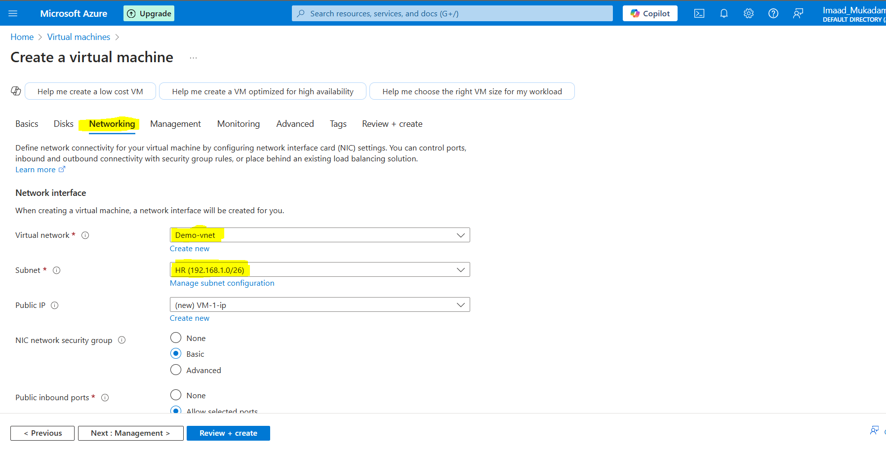

# Create-VM-With-Multiple-Subnets

## Summary

This project involves creating an Azure Virtual Network (VNet) with two subnets:

HR Department Subnet

Sales Department Subnet

Two Virtual Machines (VMs) will be deployed, one in each subnet. The goal is to test whether the VMs can communicate with each other despite being in different subnets.

This will involve configuring network security rules, route tables, and IP addressing to enable or restrict communication as needed

## Steps - 1 

Select a Virtual Network

Configure the Basic Information

Now go into IP Addresses

i. Select the IP address class (Mine is Class C)

ii.Select the CIDR

iii. Now Click on Add a subnet

Creating HR subnet with 64 IP address Size

Click on Add button 

Similary Add Subnet of Sales Department

## Step - 2

Now Lets Create 2 VMs

i. Configure the Basic Information

ii. Then go to Networking

iii. Select the HR Subnet

iv. Click on Review and Create

Now lets Create 2nd Vm

i. Configure the Basic Information

ii. Go To networking

iii. Now Select the sales Subnet

## Step - 3 

Connect both the VMs (i'm doing using RDP file)

Cheking ip address of 1st vm

Checking ip address of 2nd Vm

Now close the Firewall of both the VMs to check if they both communicate with each others or not

## Step - 4 

Now copy the IP address of any VM and ping from another VM to check if they communicate

